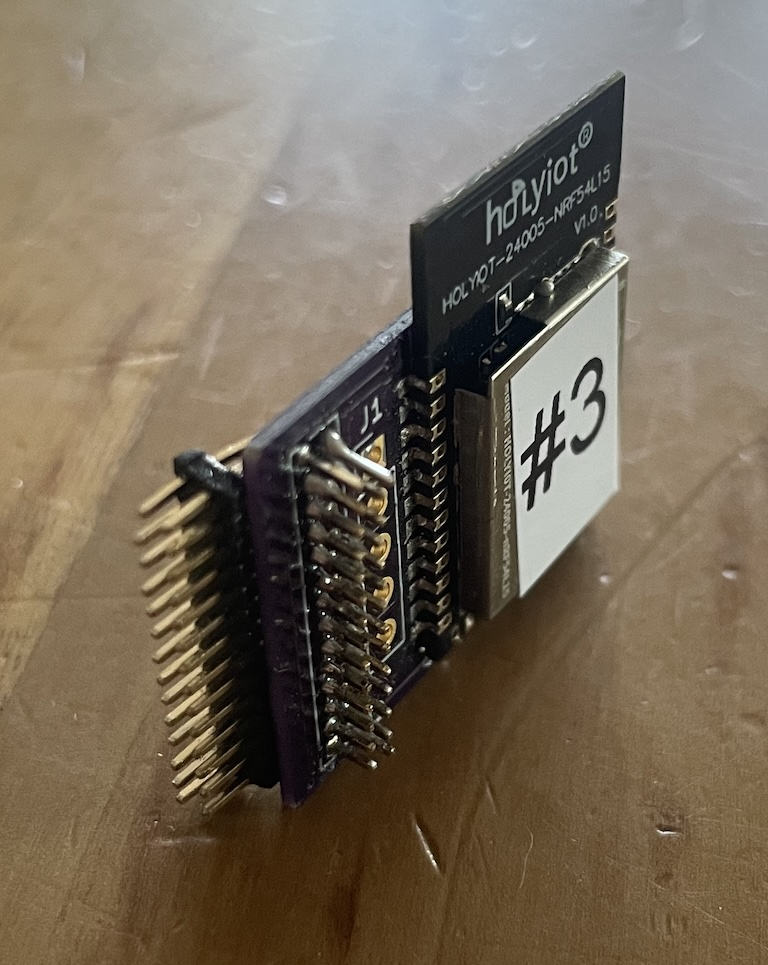
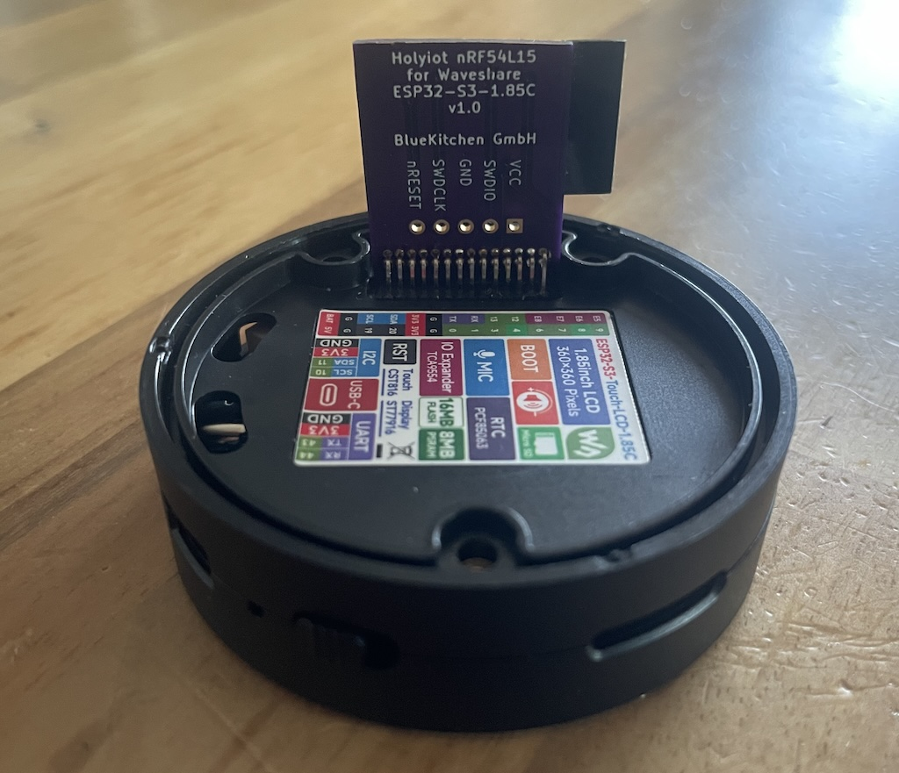

# Nordic nRF54L15 Add-On For Waveshare ESP32-S3-LCD-Touch-1.85C box

This breakout board adds a Nordic nRF54L15 Bluetooth Controller inside the speaker box of the Waveshare ESP32-S3-LCD-Touch-1.85C for LE Audio.

It uses the nRF54L15 module from Holyiot, e.g. available from AliExpress, as it is to solder due to it's castellated edges.

In addition to the full HCI UART, an additional pin is connected for time sync, required for True Wireless Stereo (TWS) in LE Audio.

## Flashing the nRF54L15
After soldering, it can be mounted on the Waveshare box to provide power.
It can then and be programmed with an SWD programmer via the provided pin-header through-holes.

## Pin Out 

UART functions as seen from nRF54L15

|ESP32-S3 GPIO | Function  | nRF54L15|
|--------------|-----------|---------|
| 1            | nRESET    | nRESET  |
| 7            | TX        | P1.04   |
| 6            | RX        | P1.05   |  
| 12           | RTS       | P1.06   |
| 13           | CTS       | P1.07   |
| 13           | Time Sync | P1.11   |

## Images

